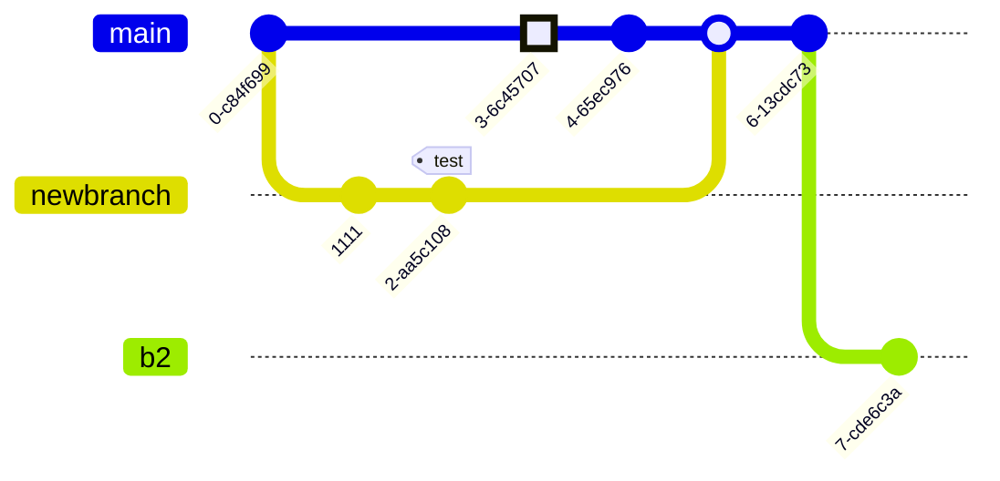

<!-- slide bg="[[vergissberlin_Microcontroller_with_a_happy_ending_49de1ac8-6ebf-45f3-aae3-9a6c13817ca2.png]]" data-auto-animate     -->

# Bastelrunde 
<!-- element style="padding-top: 30%; text-shadow: 4px 4px 2px 2px #000;" -->
## #013 Product Webpage

<!-- element style="text-shadow: 4px 4px 2px 2px #000" -->

<!--
**Checkliste bevor es losgeht:**

- [ ] Foto gemacht
- [ ] Tweet gesendet
- [ ] Hochkant Video

-->

---

## Onboarding

1) Was ist LoRaWAN Leipzig
2) Wo wir uns befinden
3) Wo die Toiletten sind
4) Wo gibt es Getränke?

<!--
- [ ] Was ist LoRaWAN Leipzig
	- [ ] Ziele
	- [ ] Wer sind die Leute
- [ ] Wo befinden wir uns (Basislager, Kohlenstraße)
- [ ] Wo sind die Toiletten
- [ ] Wo gibt es Getränke?
-->

--

<!-- slide bg="[[vergissberlin_man_on_a_roof_top_with_an_antenna_and_a_soldering_17ba6cf4-1d1b-4eba-b3ee-30b9431dd2c1.png]]" -->

<grid drag="60 30" bg="#ffffff88" style="border-radius: 12px;backdrop-filter: blur(20px);" pad="1em 2em 1em 1em">

<small>sponsored by</small>

</grid>

--

## Projektübersicht

1) ✅ Hardware Prototyp
2) ✅ Verbindung mit TTN
3) ✅ Automatisierte Releases auf GitHub
4) 👩‍💻 Veröffentlichung
5) Datenverarbeitung in NodeRED
6) Datenmonitoring und Visualisierung

---
<!-- slide bg="[[vergissberlin_microcontroller_flying_through_clouds_e4ca3e11-4904-4bfb-a259-0a4fbf2dee4e.png]]" -->

<grid drag="60 30" bg="#000000cc" style="border-radius: 12px;backdrop-filter: blur(10px);" pad="1em 2em 1em 1em">

## Today 👩‍💻🧑🏼‍💻👨🏻‍💻

1) **Planung**
1) **Inhalte und Design**
1) **Werkzeuge und Technologien auswählen**
1) **Entwicklung**
1) **Webhosting**
1) **Installation**
1) **Inhaltserstellung**
1) **Testen**
1) **Launch**
2) **Marketing & SEO**
</grid>

<!--

1. **Planung**
   - Definieren des Ziel der Produktseite.
   - Bestimmen der Zielgruppe für das Produkt.
   - Entscheiden, welche Informationen und Funktionen auf der Seite vorhanden sein sollen (z. B. Produktbeschreibungen, Bilder, Preise, Bewertungen).
2. **Design**
   - Erstellen eines Layout für die Seite.
   - Wählen eines Farbschemas und Typografie aus, die zum Branding passen.
   - Entwerfen einer Benutzerführung und Navigation.
3. **Werkzeuge und Technologien auswählen**
   - Entscheiden für eine CSS Frameworks.
   - WebInstaller heraussuchen
4. **Entwicklung**
   - Erstellen der HTML-Struktur der Webseite.
   - Stilisieren der Seite mit CSS.
   - Hinzufügen des Web-Installers.
5. **Webhosting**
   - Suchen eines Hosting-Anbieters.
   - Konfiguration der Domain.
6. **Installation**
    - Upload der Webseite auf den Server.
7. **Inhaltserstellung**
    - Hinzufügen weiterer Inhalte – dies umfasst Texte, Bilder und Videos über das Produkt.
    - Optimalerweise sollten SEO-Praktiken berücksichtigt werden (Stichwortrecherche, Meta-Tags).
8. **Testen**
    - Überprüfen der Funktionalität und des Designs auf verschiedenen Geräten und Browsern.
    - Testen der Ladegeschwindigkeit.
9. **Launch**
    - Veröffentlichen der Seite im Internet nach abschließenden Tests.
10. **Marketing & SEO**
     - Vermarkten der Seite über soziale Medien
     - Kontinuierliche Suchmaschinenoptimierung betreiben.
11. **Wartung & Updates**
     - Regelmäßige Aktualisierung des Inhalts sowie Sicherheitsupdates durch GitHub Pipelines.
12. **Analyse**
     - Nutzen von Google Analytics oder anderen Tools zur Überwachung des Traffics und zur Verbesserung der User Experience basierend auf Nutzerdaten.

-->

--
### Planung

1) Definieren des Ziel der Produktseite.
2) Bestimmen der Zielgruppe für das Produkt.
3) Entscheiden, welche Informationen und Funktionen auf der Seite vorhanden sein sollen (z. B. Produktbeschreibungen, Bilder, Preise, Bewertungen).
--

### Design

1) Erstellen eines Layout für die Seite.
2) Wählen eines Farbschemas und Typografie aus, die zum Branding passen.
3) Entwerfen einer Benutzerführung und Navigation.

--

### Werkzeuge und Technologien auswählen

1) Entscheiden für eine CSS Frameworks.
2) WebInstaller heraussuchen

--
### Entwicklung

1) Erstellen der HTML-Struktur der Webseite.
2) Stilisieren der Seite mit CSS.
3) Hinzufügen des Web-Installers.

--
### Webhosting

1) Suchen eines Hosting-Anbieters.
2) Konfiguration der Domain.

--
### Installation

1) Upload der Webseite auf den Server.

--
### Inhaltserstellung

1) Hinzufügen weiterer Inhalte – dies umfasst Texte, Bilder und Videos über das Produkt.
2) Optimalerweise sollten SEO-Praktiken berücksichtigt werden (Stichwortrecherche, Meta-Tags).

--
### Testen

1) Überprüfen der Funktionalität und des Designs auf verschiedenen Geräten und Browsern.
2) Testen der Ladegeschwindigkeit.

--
### Launch
1) Veröffentlichen der Seite im Internet nach abschließenden Tests.

--
### Marketing & SEO
1) Vermarkten der Seite über soziale Medien
2) Kontinuierliche Suchmaschinenoptimierung betreiben.

--
### Wartung & Updates
 1) Regelmäßige Aktualisierung des Inhalts sowie Sicherheitsupdates durch GitHub Pipelines.

--
### Analyse
 1) Nutzen von Google Analytics oder anderen Tools zur Überwachung des Traffics und zur Verbesserung der User Experience basierend auf Nutzerdaten.

--

--
## Off-boarding

1) 🏁 Was wir heute geschafft haben
2) 🔎 Wo man den Quellcode findet
3) 🙋‍♂️ Fragen, Nöte oder Anregungen?
4) 📆 Wann wir uns das nächste Mal treffen
5) 🫥 Nothing left behind
	- 🚪 Türen zu
	- 🗑️ Müll mitnehmen
	- 🪑 Stühle ranstellen

---
## Checkliste nach der Veranstaltung

-  Hardware zusammengesucht und eingepackt
- Nachher Foto
- Folgetermin Termin steht fest
- Hochkant Video - Zusammenfassung, Folgetermin
