```mermaid
sequenceDiagram
    participant User as Benutzer
    participant Browser as Browser (Webanwendung)
    participant ESP32 as ESP32
    
    Note over User,Browser: Benutzer öffnet die Webanwendung im Browser.
    
    User->>Browser: Klick auf "Connect"
    activate Browser
    Browser->>ESP32: Anfrage, um sich mit dem seriellen Port zu verbinden
    activate ESP32
    ESP32-->>Browser: Bestätigung der Verbindung
    
    Note over User,Browser: Verbindung ist nun hergestellt.
    
    User->>Browser: Gibt Befehl ein und klickt auf "Send"
    
    Browser->>ESP32: Sendet Befehl über serielle Schnittstelle
    activate ESP32
    ESP32-->>Browser: Führt Befehl aus und sendet Antwort
    
    deactivate ESP32
    
    Browser-->>User: Zeigt Antwort im Interface an
    
    deactivate Browser


```

<style>
@import url('https://fonts.googleapis.com/css2?family=Lobster&family=Permanent+Marker&display=swap');
h1, h2 {
	font-family: 'Permanent Marker', cursive !important;
	text-shadow: 0 0 12px #000 !important;
}
</style>

<!-- slide bg="[[meetup-014.png]]" data-auto-animate     -->

# Bastelrunde 
<!-- element style="padding-top: 30%; text-shadow: 4px 4px 2px 2px #000;" -->
## #014 Serial Config

<!-- element style="text-shadow: 4px 4px 2px 2px #000" -->

<!--
**Checkliste bevor es losgeht:**

- [ ] Foto gemacht
- [ ] Tweet gesendet
- [ ] Hochkant Video

-->

---

## Onboarding

1) Was ist LoRaWAN Leipzig
2) Wo wir uns befinden
3) Wo die Toiletten sind
4) Wo gibt es Getränke?

<!--
- [ ] Was ist LoRaWAN Leipzig
	- [ ] Ziele
	- [ ] Wer sind die Leute
- [ ] Wo befinden wir uns (Basislager, Kohlenstraße)
- [ ] Wo sind die Toiletten
- [ ] Wo gibt es Getränke?
-->

--

<!-- slide bg="[[vergissberlin_man_on_a_roof_top_with_an_antenna_and_a_soldering_17ba6cf4-1d1b-4eba-b3ee-30b9431dd2c1.png]]" -->

<grid drag="60 30" bg="#ffffff88" style="border-radius: 12px;backdrop-filter: blur(20px);" pad="1em 2em 1em 1em">

<small>sponsored by</small>


</grid>

--

## Projektübersicht

1) ✅ Hardware Prototyp
2) ✅ Verbindung mit TTN
3) ✅ Automatisierte Releases auf GitHub
4) 👩‍💻 Veröffentlichung
5) Datenverarbeitung in NodeRED
6) Datenmonitoring und Visualisierung


---
<!-- slide bg="[[vergissberlin_microcontroller_flying_through_clouds_e4ca3e11-4904-4bfb-a259-0a4fbf2dee4e.png]]" -->

<grid drag="60 30" bg="#000000cc" style="border-radius: 12px;backdrop-filter: blur(10px);" pad="1em 2em 1em 1em">

## Today 👩‍💻🧑🏼‍💻👨🏻‍💻

1) **Planung**
1) **Inhalte und Design**
1) **Werkzeuge und Technologien auswählen**
1) **Entwicklung**
1) **Webhosting**
1) **Installation**
1) **Inhaltserstellung**
1) **Testen**
1) **Launch**
2) **Marketing & SEO**
</grid>

--

## Web-Serial-API

Die Web-Serial-API ist eine Browser-basierte Schnittstelle, die es ermöglicht, mit Hardware-Geräten über die serielle Schnittstelle zu kommunizieren. Sie wird hauptsächlich für die Kommunikation mit Entwicklungsboards wie dem ESP32 verwendet, um Daten zu senden und zu empfangen.

---

Wenn Sie Konfigurationen auf einem ESP32 über die Web-Serial-API vornehmen möchten, müssen Sie zunächst sicherstellen, dass der ESP32 so programmiert ist, dass er Befehle über seine serielle Schnittstelle empfangen und entsprechend darauf reagieren kann. Dies erfordert normalerweise eine Firmware, die speziell dafür entwickelt wurde, Befehle zu interpretieren und Einstellungen oder Aktionen auf dem Gerät umzusetzen.


---

## Allgemeiner Ansatz

--

1) **Vorbereiten des ESP32:**
   - Flashen Sie den ESP32 mit einer Firmware, die serielle Kommunikation unterstützt (z.B. mit der Arduino IDE oder PlatformIO).
   - Implementieren Sie in Ihrem Code auf dem ESP32 einen Befehlsinterpreter, der Konfigurationsbefehle empfängt und bearbeitet.

--

2) **Einrichten der Webanwendung:**
   - Erstellen Sie eine Website oder Webanwendung, die die Web Serial API nutzen kann. Beachten Sie dabei, dass diese API nur in bestimmten Browsern (wie Chrome oder Edge) verfügbar ist.
   - Fügen Sie Ihrem Webcode JavaScript hinzu, das die API anspricht und eine Verbindung zum ESP32 herstellt.

--

3. **Verbinden und Interagieren:**
   - Öffnen Sie Ihre Webanwendung im Browser und verbinden Sie sich über ein USB-Kabel mit dem ESP32.
   - Verwenden Sie JavaScript-Funktionen zum Öffnen des seriellen Ports und zum Senden von Befehlen an den ESP32.
   - Implementieren Sie auch Funktionen zum Empfang von Daten vom ESP32.

---

Hier ein sehr einfaches Beispiel für JavaScript-Code in einer Webseite:

```javascript
let port;
let reader;
let writer;

async function connectToESP() {
  // Wählen des Ports
  port = await navigator.serial.requestPort();
  
  // Öffnen des Ports
  await port.open({ baudRate: 115200 });

  // Leser und Schreiber erstellen
  const textEncoder = new TextEncoderStream();
  writer = textEncoder.writable.getWriter();
  
  const textDecoder = new TextDecoderStream();
  reader = textDecoder.readable.getReader();

  // Stream-Pipelines einrichten
  const writableStreamClosed = textEncoder.readable.pipeTo(port.writable);
  port.readable.pipeTo(textDecoder.writable);
}

async function sendCommand(command) {
  if (writer) {
    await writer.write(command + '\n');
    console.log('Command sent:', command);
    
    // Antwort vom ESP lesen (optional)
    try {
      while (true) {
        const { value, done } = await reader.read();
        if (done || !value) {
          // Der Reader hat das Ende erreicht oder gibt keine Daten zurück.
          break;
        }
        console.log(`Received: ${value}`);
      }
    } catch (error) {
      console.error('Read error:', error);
    }
    
    // Beenden des Readers und Schließens des Streams
    await reader.releaseLock();
    await writer.releaseLock();
    
    // Port schließen
    await port.close();
    
  } else {
    console.error('No writer available');
  }
}

// Verbindungsbutton EventListener hinzufügen
document.getElementById('connectButton').addEventListener('click', connectToESP);

// Kommandobutton EventListener hinzufügen
document.getElementById('sendButton').addEventListener('click', () => {
   let command = document.getElementById('commandInput').value;
   sendCommand(command);
});
```

In diesem Beispiel wird gezeigt, wie man sich mittels eines Buttons in einer Webseite mit einem angeschlossenen Gerät verbindet (`connectToESP`) und wie man einen Befehl sendet (`sendCommand`). Der Code beinhaltet auch das Lesen einer Antwort vom Gerät nach dem Senden eines Befehls.

---

Bitte beachten Sie jedoch folgendes:
- Die tatsächliche Implementierung kann je nach Ihren Anforderungen variieren.
- Die Sicherheit sollte immer berücksichtigt werden; stellen Sie sicher, dass nur autorisierte Benutzer Zugriff auf diese Funktion haben.
- Derzeit unterstützen nicht alle Browser diese API; prüfen Sie also die Kompatibilität.

---

Um diesen Code in Ihrer Anwendung zu verwenden, müssen HTML-Elemente für `connectButton`, `sendButton` und `commandInput` vorhanden sein. Außerdem muss der Code entsprechend Ihrer spezifischen Anforderungen angepasst werden.

```mermaid
graph TD;
    A[Start] --> B{Webanwendung geöffnet}
    B -- Ja --> C[Verbindungsbutton geklickt]
    C --> D[Nutzer wählt ESP32 Port]
    D --> E{Port ausgewählt}
    E -- Ja --> F[Port wird geöffnet]
    F --> G[Serielle Kommunikation bereit]
    G --> H[Befehl wird gesendet]
    H --> I{Antwort empfangen?}
    I -- Ja --> J[Antwort anzeigen]
    I -- Nein --> K[Fehlerbehandlung]
```




--





--
## Off-boarding

1) 🏁 Was wir heute geschafft haben
2) 🔎 Wo man den Quellcode findet
3) 🙋‍♂️ Fragen, Nöte oder Anregungen?
4) 📆 Wann wir uns das nächste Mal treffen
5) 🫥 Nothing left behind
	- 🚪 Türen zu
	- 🗑️ Müll mitnehmen
	- 🪑 Stühle ranstellen

---
## Checkliste nach der Veranstaltung

-  Hardware zusammengesucht und eingepackt
- Nachher Foto
- Folgetermin Termin steht fest
- Hochkant Video - Zusammenfassung, Folgetermin
