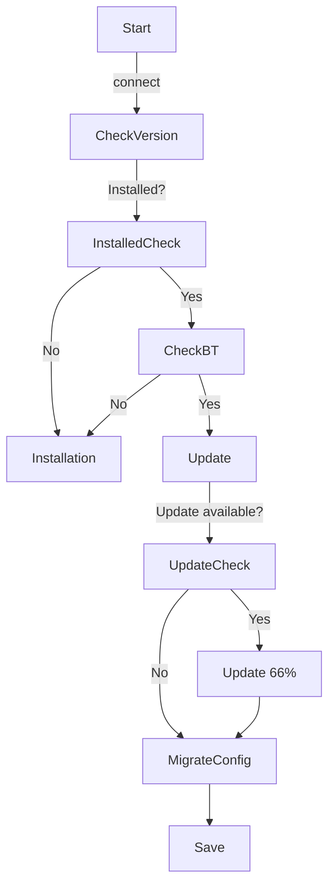
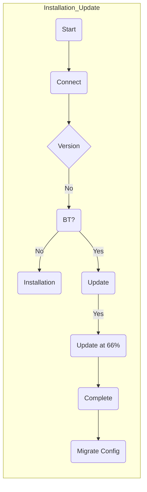
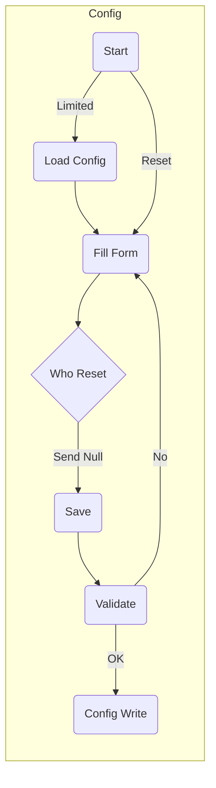
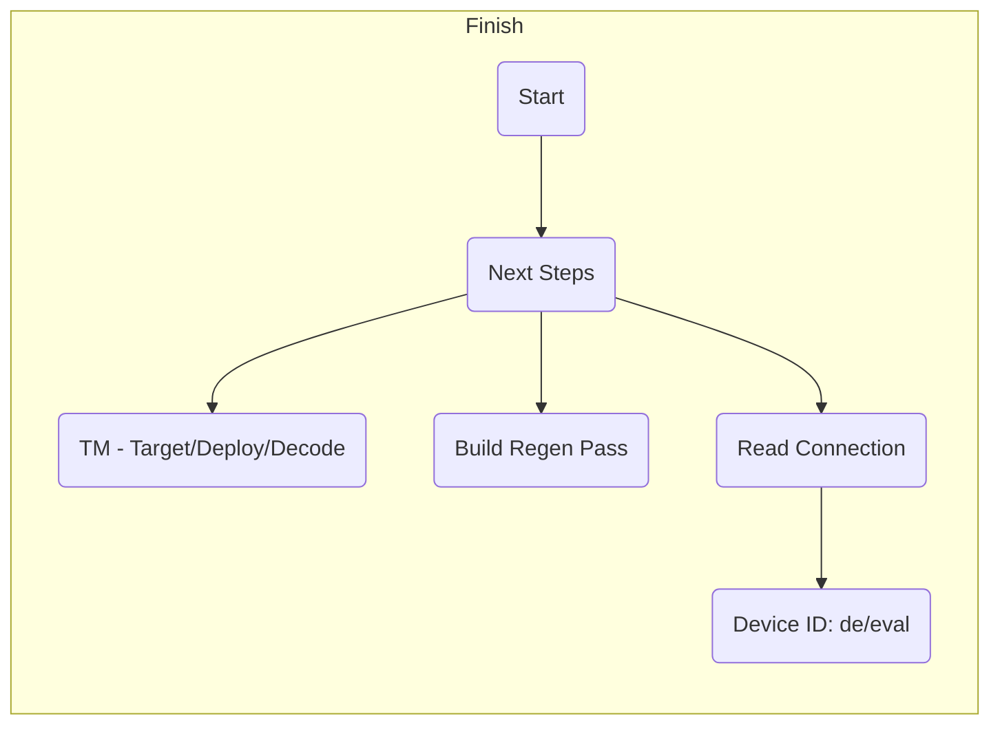

```mermaid
graph TD;
    Start -->|connect| CheckVersion
    CheckVersion -->|Installed?| InstalledCheck
    InstalledCheck -->|Yes| CheckBT
    InstalledCheck -->|No| Installation
    CheckBT -->|Yes| Update
    CheckBT -->|No| Installation
    Update -->|Update available?| UpdateCheck
    UpdateCheck -->|Yes| Progress[Update 66%]
    UpdateCheck -->|No| MigrateConfig
    Progress --> MigrateConfig
    MigrateConfig --> Safe[Save]
```

## Flow

### Installation

```mermaid
flowchart TD
subgraph Installation_Update
	direction TB
	
	A1(Start) --> B1(Connect)
	B1 --> C1{Version}
	C1 -->|No| D1(BT?)
	D1 -->|No| E1(Installation)
	D1 -->|Yes| F1(Update)
	F1 -->|Yes| G1(Update at 66%)
	G1 --> H1(Complete)
	H1 --> I1(Migrate Config)
end
```

```mermaid
flowchart TD
subgraph Config
	direction TB
	A2(Start) -->|Limited| B2(Load Config)
	B2 --> C2(Fill Form)
	C2 --> D2{Who Reset}
	D2 -->|Send Null| E2(Save)
	E2 --> F2(Validate)
	F2 -->|OK| G2("Config Write")
	F2 -->|No| C2
	A2 -->|Reset| C2
end
```

```mermaid
flowchart TD
subgraph Finish
	direction TB
	A3(Start) --> B3(Next Steps)
	B3 --> C3(TM - Target/Deploy/Decode)
	B3 --> D3(Build Regen Pass)
	B3 --> E3(Read Connection)
	E3 --> F3(Device ID: de/eval)
end
```
