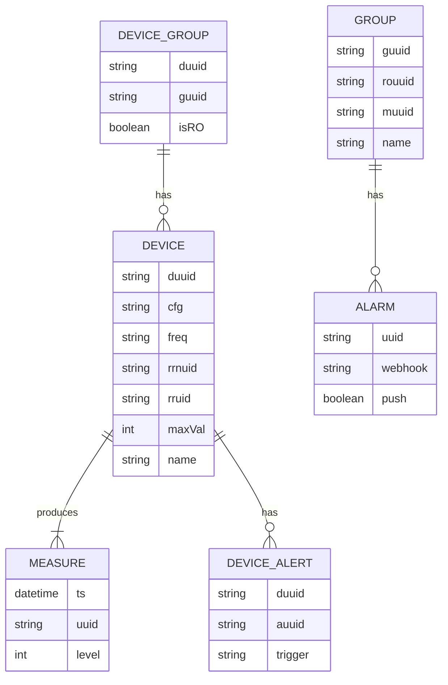

Database model

```mermaid

erDiagram
DEVICE_GROUP {
	string duuid
	string guuid
	boolean isRO
}
DEVICE {
	string duuid
	string cfg
	string freq
	string rrnuid
	string rruid
	int maxVal
	string name
}
MEASURE {
	datetime ts
	string uuid
	int level
}
GROUP {
	string guuid
	string rouuid
	string muuid
	string name
}

ALARM {
	string uuid
	string webhook
	boolean push
}
DEVICE_ALERT {
	string duuid
	string auuid
	string trigger
}

DEVICE_GROUP ||--o{ DEVICE : has
DEVICE ||--|{ MEASURE : produces
DEVICE ||--o{ DEVICE_ALERT : has
GROUP ||--o{ ALARM : has
```
